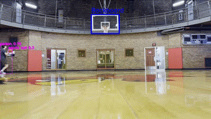

# Basketball Shot Tracking with YOLO and Image Segmentation



This project leverages the power of YOLOv8 (You Only Look Once) and image segmentation techniques to track basketball shots and predict whether the ball will go in or not. Combining cutting-edge computer vision with my love for basketball, this tool aims to provide valuable insights into shooting performance and help improve accuracy on the court.

### Project Overview

As an avid basketball enthusiast, I wanted a way to track my shooting statistics while practicing. The goal of this project is to analyze basketball shots using computer vision techniques and determine the likelihood of success. This system uses both physics-based models and parabolic curve-fitting trajectories to predict shot outcomes.

### Features

- **Object Detection with YOLO**: YOLO is utilized for real-time object detection, accurately identifying the basketball and the hoop within video frames.
- **Image Segmentation**: This technique is used to segment the ball and hoop from the background, allowing for precise tracking of the ball's path.
- **Physics-Based Trajectories**: Implements a physics-based model to simulate the ball's trajectory, taking into account variables such as speed, angle, and spin.
- **Parabolic Curve Fitting**: Uses mathematical models to fit a parabolic curve to the ball's path, enhancing the prediction accuracy of the shot's outcome.

### Why This Project?

Basketball has always been a passion of mine, and I wanted a tool to objectively analyze my shooting technique. By combining my interest in sports with a desire to improve my skills in computer vision, I created this project to automate the tracking of my shooting statistics. This tool not only helps me better understand my performance but also serves as a platform to hone my skills in computer vision and machine learning.

### Getting Started

To get started with this project, you will need to set up the necessary dependencies and run the system on a video of basketball shots. Detailed instructions on installation and usage can be found in the sections below.

##### Prerequisites

- Python 3.x
- OpenCV
- PyTorch (for YOLO implementation)
- Additional Python libraries as listed in requirements.txt

##### Installation

1. Clone this repository:

```bash
git clone https://github.com/yourusername/basketball-shot-tracking.git
```

2. Navigate to the project directory:

```bash
cd Basketball-Shot-Detection
```

3. Installed the required packages with conda:

```bash
conda env create -f environment.yml
```

### Future Work

I plan to enhance the model's accuracy by integrating more sophisticated machine learning techniques and expanding its capabilities to analyze different types of shots. Since it currently only uses the estimated ball trajectory to predict the shot, it can sometimes incorrectly guess because the video feed is only 2D. This means that the ball can hit the back of the rim even though the 2D trajectory looks like it's going through the hoop. It also doesn't currently have a way of seeing whether the shot went in. I did try custom training on this [Roboflow dataset](https://universe.roboflow.com/biomechanics/basketball-annotation-training), but it had worse performance than YOLOv8L. Effectively utilizing transfer learning is another area of future work. I'm also considering developing a user-friendly interface to make this tool accessible to other basketball enthusiasts.
